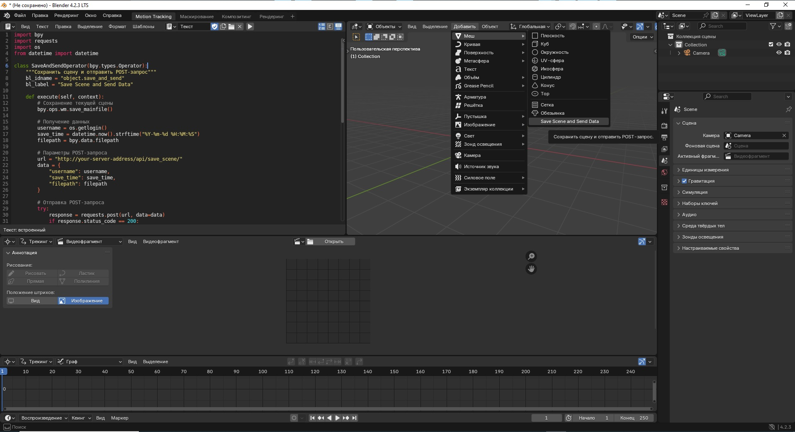
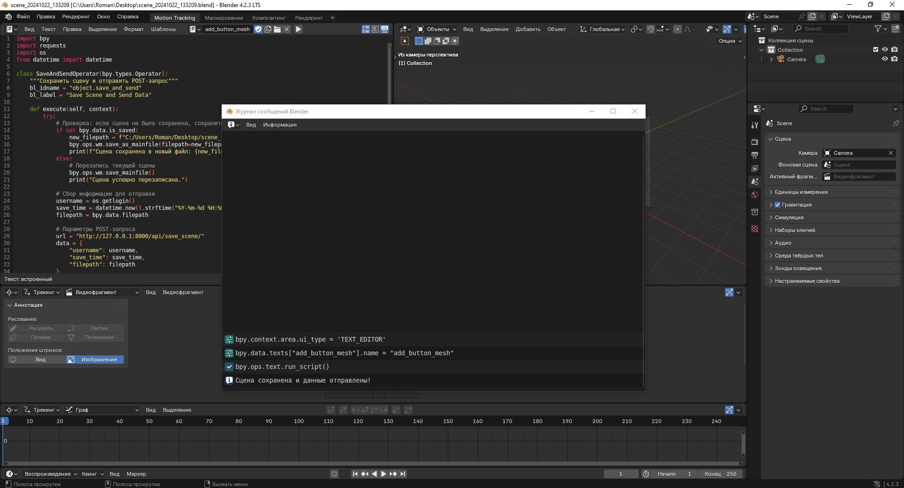
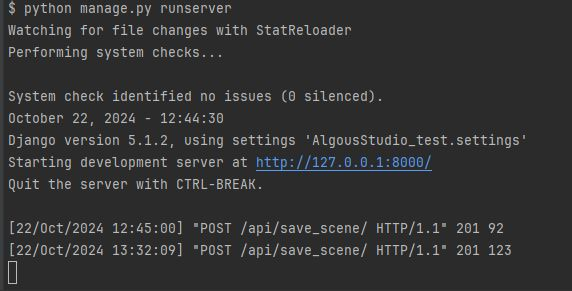
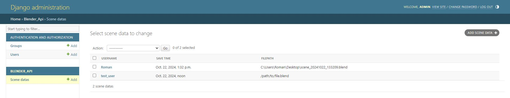
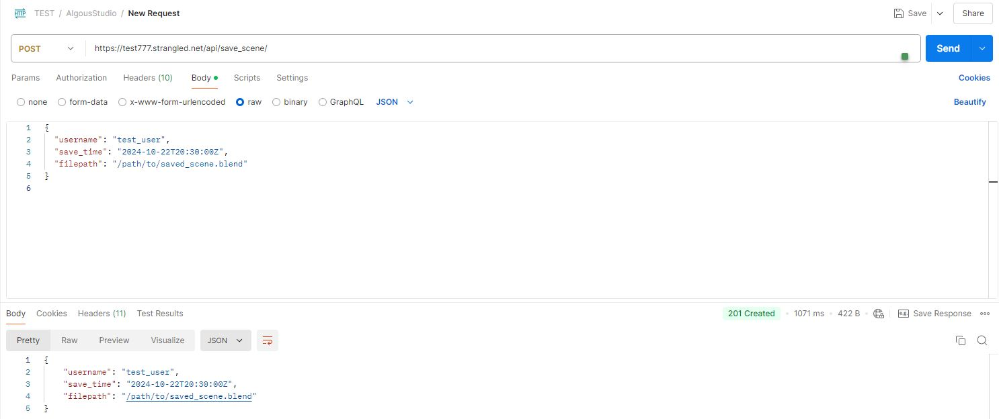
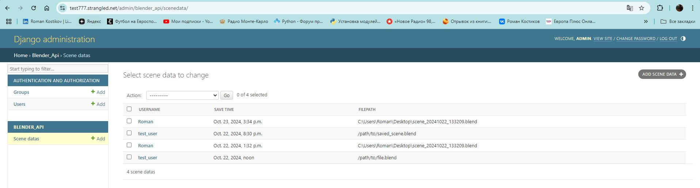

# Тестовое задание от AlgousStudio

## ТЗ для позиции VFX Technical Engineer

### Задача:
1.	Создать кнопку в Blender, при нажатии на которую будет происходить:
•	Сохранение текущей сцены Blender.
•	Отправка POST-запроса на API Django-сервера, содержащего следующую информацию:
•	Имя пользователя.
•	Время сохранения.
•	Путь к сохраненному файлу на диске.
2.	Развернуть Django-приложение на бесплатном VPS-сервере, которое:
•	Принимает реквест от Blender и сохраняет данные (имя пользователя, время, путь к файлу) в базу 
данных.
•	Предоставляет интерфейс админки, где можно увидеть записи из базы данных.

### Шаги выполнения:
1.	Blender:
•	Установите Blender, если он у вас не установлен: Blender Download.
•	Ознакомьтесь с документацией по написанию скриптов на Python для Blender: Blender Python API.
2.	VPS:
•	Зарегистрируйтесь и получите бесплатный VPS сервер на одной из платформ:
•	Heroku
•	AWS Free Tier
•	Google Cloud Free Tier
•	DigitalOcean (с бесплатным кредитом)
•	Настройте Docker и разверните Django-приложение, которое принимает POST-запросы и сохраняет 
данные в базу данных.

### Требования:
•	Blender: Напишите скрипт на Python, который добавляет кнопку в интерфейс Blender. При нажатии 
кнопки должна сохраняться текущая сцена, а затем отправляться POST-запрос с данными на API Django.
•	Django API: Разверните Django-приложение с REST API на вашем VPS. Реализуйте прием POST-запроса
и сохранение данных в базу данных.
•	Docker: Разверните ваше Django-приложение в Docker-контейнере на VPS.
•	База данных: Любая поддерживаемая Django база данных (SQLite, PostgreSQL, MySQL и т.д.).

### Ожидаемые результаты:
1.	GitHub-репозиторий, содержащий:
•	Скрипт для Blender, который можно установить и протестировать.
•	Dockerfile и инструкции для развертывания Django-приложения.
2.	Адрес и доступ к вашему Django-серверу:
•	URL, по которому можно проверить работу API.
•	Доступ к админке Django для проверки сохраненных данных.

### Критерии оценки:
•	Корректная работа кнопки в Blender (сохранение сцены и отправка реквеста).
•	Правильная работа Django API (прием данных и их запись в базу).
•	Прозрачная и простая установка и запуск как Blender-скрипта, так и Django-приложения.
•	Соответствие задания техническим требованиям.

### Полезные ссылки:
•	Blender Download
•	Blender Python API Documentation
•	Django Documentation
•	Docker Documentation
•	[VPS options (Heroku, AWS, Google Cloud, DigitalOcean)](https://www.heroku.com/, 
https://aws.amazon.com/free/, https://cloud.google.com/free, https://www.digitalocean.com/free)

## Решение:

### Инструкции по локальному запуску Django-приложения и настройке кнопки в Blender:

#### 1. Запуск Django-приложения локально

Шаг 1: Клонируйте репозиторий:
Скопируйте репозиторий с Django-приложением на локальный компьютер:

```bash
git clone https://github.com/RomanKostikov/AlgousStudio_test.git
cd AlgousStudio_test
```

Шаг 2: Установите зависимости:
Убедитесь, что у вас установлен Python версии 3.10+ и виртуальное окружение. Создайте и активируйте 
виртуальное окружение:

```bash
python3 -m venv venv
source venv/bin/activate  # В Windows: venv\Scripts\activate
```

Установите все зависимости из requirements.txt:

```bash
pip install -r requirements.txt
```

Шаг 3: Настройте переменные окружения(если нужно) и миграции:
Создайте файл .env в корне проекта и укажите необходимые параметры:

```.dotenv
SECRET_KEY=your_secret_key
DEBUG=True
ALLOWED_HOSTS=localhost, 127.0.0.1
```

Выполните миграции базы данных:

```bash
python manage.py migrate
```

Шаг 4: Создайте суперпользователя:
Для доступа в админ-панель создайте суперпользователя:

```bash
python manage.py createsuperuser
```
Следуйте инструкциям в терминале (укажите имя пользователя, email и пароль).

Шаг 5: Запустите локальный сервер:
Запустите Django-приложение локально:

```bash
python manage.py runserver
```
Приложение будет доступно по адресу:
http://127.0.0.1:8000

Шаг 6: Проверьте админ-панель:
Перейдите в браузер и откройте http://127.0.0.1:8000/admin/. Войдите с данными, которые вы 
указали при создании суперпользователя.

#### 2. Настройка кнопки в Blender

Шаг 1: Убедитесь, что Blender установлен:
Скачайте и установите Blender с официального сайта.

Шаг 2: Скопируйте содержимое Python-скрипт(button_blender.py) для Blender
Файл находиться в корне проекта.

Шаг 3: Подключите скрипт в Blender:
Откройте Blender.
Перейдите в меню Scripting (вверху интерфейса).
Создайте новый текстовый файл, нажав New.
Вставьте код из button_blender.py в текстовый редактор Blender.
Нажмите Run Script.

Шаг 4: Используйте кнопку в Blender:
Перейдите в меню Mesh в верхней панели(см. скриншот 1)



Вы увидите новую кнопку "Save Scene and Send Data ".
Нажмите на нее, чтобы сохранить текущую сцену и отправить данные на ваш локальный сервер.\

Шаг 5: Проверьте данные в Django-админке
После нажатия на кнопку и успешной отправки данных откройте админ-панель Django на:

http://127.0.0.1:8000/admin/

Перейдите в раздел, где хранятся данные, и проверьте, что новая запись была добавлена.







Отладка
- Если не работает отправка данных, проверьте логи в Blender и на сервере Django.
- Убедитесь, что ваш локальный сервер работает и API-эндпоинт доступен.

### Инструкции по запуску Django-приложения на сервере и настройке кнопки в Blender:

#### 1. Запуск Django-приложения на сервере

Шаг 1: Подключение к серверу(использовал VDS от timeweb):
Подключитесь к вашему серверу через SSH:

```bash
ssh root@<ваш_ip_адрес>
```

Шаг 2: Клонируйте репозиторий на сервере(можно скопировать проект на сервер с использованием fz):
На сервере склонируйте ваш репозиторий с проектом:

```bash
git clone https://github.com/RomanKostikov/AlgousStudio_test.git
cd AlgousStudio_test
```

Шаг 3: Настройте переменные окружения и зависимости:
1. Убедитесь, что Docker установлен на сервере:

```bash
docker --version
```
Если Docker не установлен, следуйте официальной инструкции Docker.

2. Создайте .env файл(если нужен(В данной работе этот файл не использовался)):

```bash
nano .env
```

Вставьте в файл:

```dotenv
SECRET_KEY=your_secret_key
DEBUG=False
ALLOWED_HOSTS=test777.strangled.net, www.test777.strangled.net
```

Развернуть проект сразу на HTTPS не получится, так как сертификация выполняется в два этапа:

1) Сначала через HTTP получаем сертификаты;
2) Затем правим настройки в nginx.conf для HTTPS (используя полученные сертификаты);
3) Инструкции для этого приведены ниже.

Инструкции по запуску готовых файлов на VDS из папки PROD:
1) В директории start находятся файлы для первого этапа настройки(сначала их копируем в корневую 
директорию);
2) В директории finish расположены файлы для второго этапа настройки(эти файлы копируем с заменой 
после первого этапа);
3) Файлы, находящиеся вне директорий (Dockerfile_django, settings.py(этот файл нужно скопировать 
с заменой в AlgousStudio_test)), не изменяются на обоих этапах настройки.;
4) Если сделать всё быстро, браузер может выдать предупреждение о безопасности:
Решение:
Немного подождите и перезапустите сервисы:
```bash
docker-compose down
docker-compose up -d
```
5) Не забудьте настроить автопродление сертификатов!
Для этого используйте файл(в данной работе этот файл не использовался):
renew_certificates.sh

Основные команды для работы с Docker:
Сборка образа(джанго приложения):
```bash
docker build -t django-app:latest -f Dockerfile_django . 
```

Собрать проект:
```bash
docker-compose up -d
```

Удалить проект:
```bash
docker-compose down
```

Посмотреть образы:

```bash
docker images
```

Удалить образы:

```bash
docker rmi <id образа>)
```

Посмотреть логи сервисов:

```bash
docker-compose logs
```

#### 2. Настройка кнопки в Blender

Поменяйте параметры POST-запроса в Blender-скрипте:
```
            # Параметры POST-запроса
#            url = "http://127.0.0.1:8000/api/save_scene/"
            url = "https://test777.strangled.net/api/save_scene/"

```

Запустите скрипт и нажмите на кнопку.


Предварительно можно протестировать POST-запрос в Postman, например:



#### Шаг 4: Проверка данных на сервере

Зайдите на страницу:

```bash
https://test777.strangled.net/admin/
```
Войдите в админку и проверьте, что данные успешно сохранены(логин и пароль от admin отправил 
по почте).



#### Заключение

Теперь ваше приложение запущено на сервере, а кнопка в Blender работает с сервером через HTTPS. 
Если возникнут какие-либо проблемы, проверьте логи контейнеров с помощью:

```bash
docker-compose logs
```
